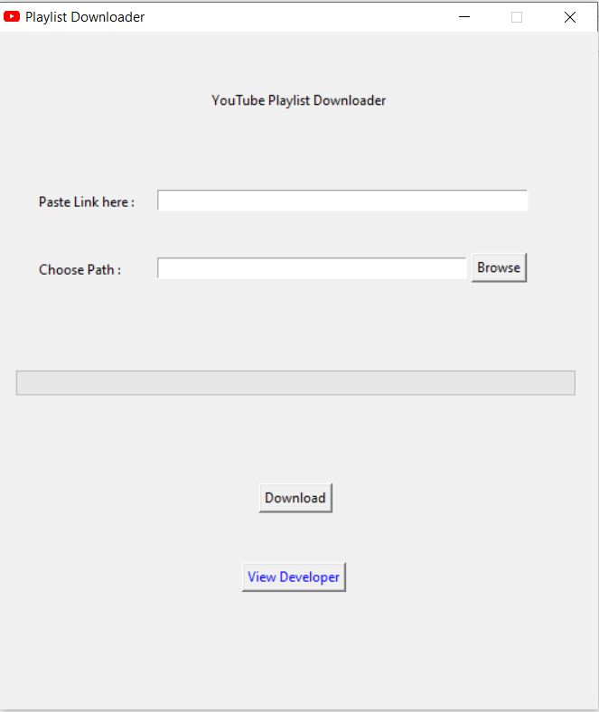
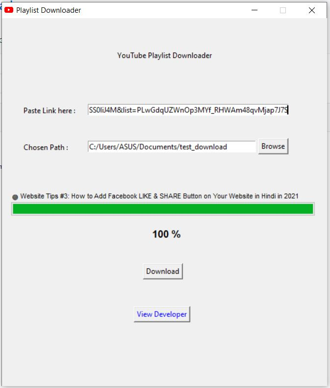

# youtube-playlist-downloader

A simple application to download all the videos from a YouTube playlist.

1. Paste in the link containing the playlist id (looks like, list=PLwGdqUZWnOp3MYf_RHWAm48qvMjap7J7S).

   Any of the example given below will have same effect, just needs to have playlist id in the link.  

    example 1 : "https://www.youtube.com/watch?v=PfUSS0liJ4M&list=PLwGdqUZWnOp3MYf_RHWAm48qvMjap7J7S"
  
    example 2 : "https://www.youtube.com/playlist?list=PLwGdqUZWnOp3MYf_RHWAm48qvMjap7J7S"

    

2. Specify the download path by clicking the "Browse" button,leaving it blank will download the contents
   in the same directory as that of the application. 

3. Hit the "Download" button and downloading starts, wait for it to complete.

    

4. Happy Downloading 😎😎 

